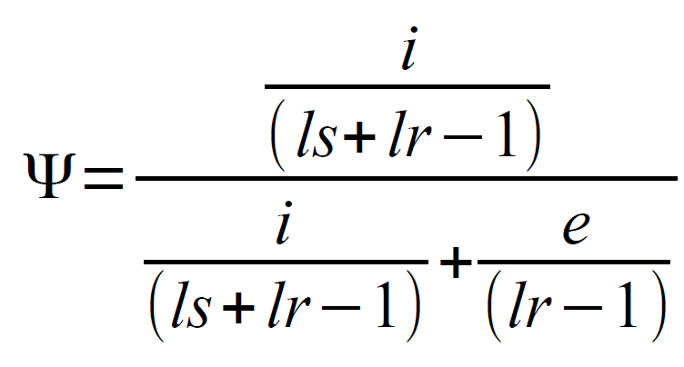

# SAJR
SAJR is R-package to perform alternative splicing quantification and differentiall splicing analysis using bulk RNA-seq data. SAJR pipeline consists of two steps:
1. Preparation of annotation. SAJR uses annotation in its own gff-based format. To convert `gtf` or `gff3` into format acceptable use `gff2sajr` or `gff32sajr` methods (see below).
2. Counting reads using java-written read-counter. It takes bams and annotation in gff format as input and produces text files with read counts.
3. Differentiall (and other downstream) analysis using R-package from this repository. It take gtf and output from read-counter as input.

# Installation
R-package can be installed from within R-session by
```
devtools::install_github('iaaka/sajr')
```
The precompiled read-counter jar and config can be downloaded from [github](https://github.com/iaaka/sajr-java) by
```
wget https://github.com/iaaka/sajr-java/raw/main/sajr.jar
wget https://github.com/iaaka/sajr-java/raw/main/sajr.config
java -jar sajr.jar
```
Last command should print short help message, if it works then sajr was downloaded succesfully.
# Testing
Download test data:
```
git clone https://github.com/iaaka/sajr-java.git
mv sajr-java/example .
rm -rf sajr-java
```
Then run sajr read counter on toy dataset:
```
java -jar sajr.jar count_reads
```
It will use parameters, input, and output files specified in `sajr.config` that points to data in `example` folder. It should produce `.gene`, `.seg`, and `.intron` files for each of two input files (six in total).
# How it works
SAJR works on level  of segments - parts of gene between two closest splicing sites or TSS or polyA-sites. Then for each segment it counts number of reads that supports its inlusion (reads that overlap the segment, inclusion reads) and these that supports its exclusion (reads mapped to exon-exon junctions that span the segment, exclusion reads). 
<br>
<br>
SAJR normalize these counts by read and segment length to calculate psi (percent spliced in):
<br>
<br>
SAJR uses generalized linear models (`glm`) with quasibinomial distribution (to acccount for biological variability) for differential splicing test.

## Annotation conversion
To split intput gene annotation in `gtf` or `gff3` format into segments one of command below can be used, use `gtf` option if possible as more stable:
```
java -jar sajr.jar gff2sajr -ann_foreign=input.gtf -ann_out=output.sajr
```
or
```
java -jar sajr.jar gff32sajr -ann_foreign=input.gff3 -ann_out=output.sajr
```
## Read-counter
Read-counter takes converted annotation and bam files as input and returns. The parameters can be provided either in config file or redefined in command line. By default config file should be named `sajr.config` and placed in the same folder as `sajr.jar`, or it can be specified by command line parameters:
```
java -jar sajr.jar count_reads my.config \
  -batch_in=example/1.bam \
  -batch_out=out1 \
  -ann_in=example/a.gff \
  -count_only_border_reads=true
```
For parameters please see detailed [manual](https://htmlpreview.github.io/?https://raw.githubusercontent.com/iaaka/sajr/main/counter_man.html).
## Sajrcomp
Sajrcomp takes two annotation files in SAJR-format (gff), provides comparing of features and returns the counts of features overlapping.
```
java -jar sajr.jar sajrcomp \
  -comp_ann1=ann1 \
  -comp_ann2=ann2 \
  -comp_out=output.tsv
```
Output
A signle file with four columns:

    gene_id1 - gene identifier from comp_ann1
    gene_id2 - gene identifier from comp_ann2
    class - class of overlap (see below)
    number of introns: in gene from comp_ann1, from comp_ann2 and common 

Overlap classes

    = - both genes have exactly the same set of junctions
    c - junctions of one gene are subset of junctions of other one
    j - genes share some junctions
    e - genes overlap by exons in sense
    i - one gene is within intron of other one (in sense)
    a - one gene is within intron of other one (in antisense)
    x - genes overlap by exons in antisense
## R-package
See [tutorial](tutorial/tutorial.R).
# Citing SAJR
* P. Mazin, J. Xiong, X. Liu, Z. Yan, X. Zhang, M. Li, L. He, M. Somel, Y. Yuan, Y.P. Chen, N. Li, Y. Hu, N. Fu, Z. Ning, R. Zeng, H. Yang, W. Chen, M. Gelfand and P. Khaitovich. Widespread splicing changes in human brain development and aging. Molecular Systems Biology 9:633. [doi](https://doi.org/10.1038/msb.2012.67)
